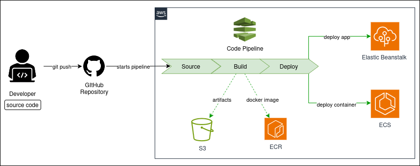
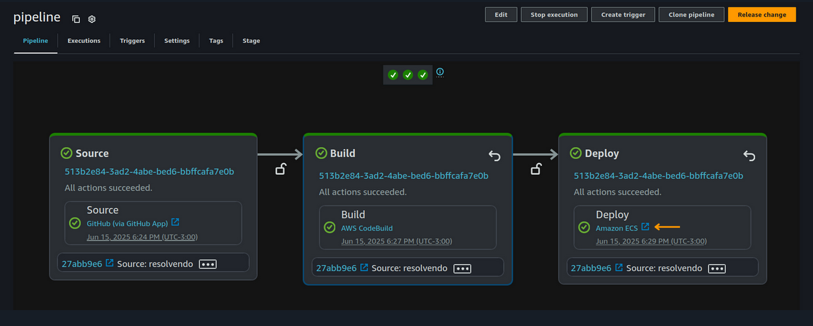
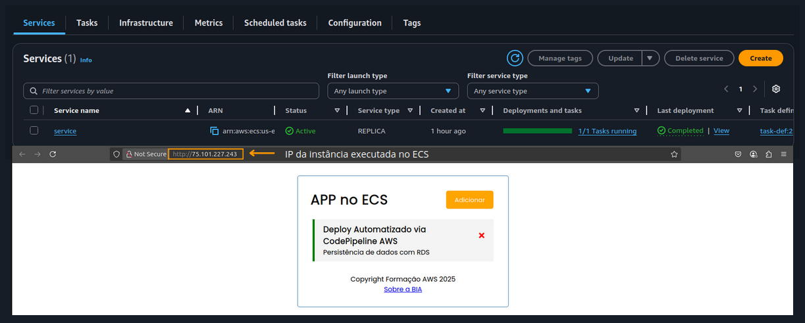
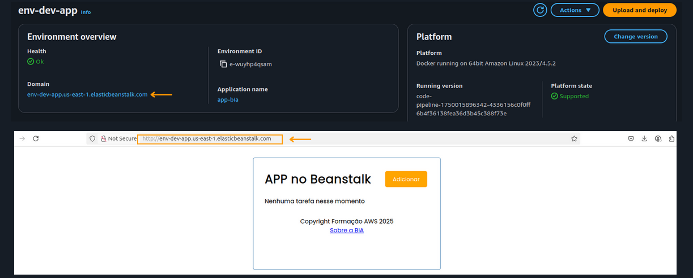
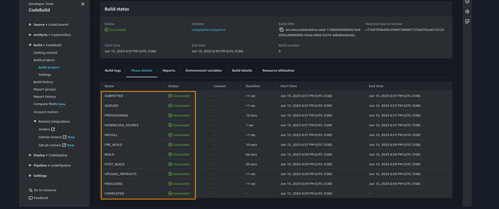
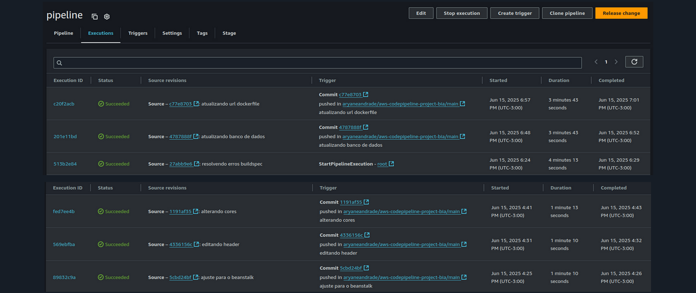

# 🚀 Projeto CI/CD na AWS – Deploy Automatizado com CodePipeline, CodeBuild, Elastic Beanstalk e ECS

Este repositório contém o resultado de um desafio prático realizado durante a **Mentoria Desafio Labs 2.0 da Formação AWS com Henrylle Maia**.

O objetivo principal foi construir pipelines de **Integração Contínua** e **Entrega Contínua (CI/CD)** utilizando os serviços da **Amazon Web Services (AWS)**, criando um fluxo de deploy totalmente automatizado a partir de alterações no código-fonte hospedado no **GitHub**.

---

## ✅ Objetivo do Projeto

Implementar pipelines que automatizam o ciclo completo de entrega de software:

Push no GitHub → Build → Deploy Automatizado → Produção

Com isso, qualquer modificação realizada no repositório dispara automaticamente os processos de build e deploy para o ambiente de produção na AWS.

---

## 🧱 Arquitetura da Solução

O fluxo de CI/CD foi dividido em dois cenários principais:

- **Deploy em ambiente PaaS:** utilizando **AWS Elastic Beanstalk**
- **Deploy de containers:** utilizando **Amazon ECS com instâncias EC2**

Diagrama de arquitetura:

---

## 🛠️ Serviços AWS Utilizados

| Serviço | Função no Projeto |
|---|---|
| **AWS CodePipeline** | Orquestração de todo o fluxo CI/CD |
| **AWS CodeBuild** | Build, compilação e criação de artefatos |
| **AWS Elastic Beanstalk** | Deploy de aplicações web |
| **Amazon ECS (EC2)** | Execução de containers Docker |
| **Amazon ECR** | Registro e armazenamento das imagens Docker |
| **GitHub** | Repositório de código-fonte e gatilho do pipeline |

---

## 🔎 Cenários Desenvolvidos

### 1️⃣ Pipeline para Amazon ECS (EC2)

**Descrição:** Deploy de uma aplicação containerizada em um **Cluster ECS com instâncias EC2**.

**Fluxo de execução:**

- Detecção de push no GitHub
- Build da imagem Docker no **CodeBuild**
- Push da imagem para o **Amazon ECR**
- Deploy automatizado no ECS

📸 Pipeline em Execução - Status das Etapas:

📸 Aplicação:

---

### 2️⃣ Pipeline para Elastic Beanstalk

**Descrição:** Deploy de uma aplicação Node.js utilizando o **Elastic Beanstalk**, uma plataforma PaaS gerenciada da AWS.

**Fluxo de execução:**

- Monitoramento de alterações no GitHub (branch principal)
- Build no **AWS CodeBuild**
- Deploy automático no ambiente Elastic Beanstalk

📸 Aplicação:

---

## 🧠 Principais Aprendizados

✔️ Estruturação de pipelines CI/CD nativos na AWS  
✔️ Integração prática entre **GitHub**, **CodePipeline**, **CodeBuild**, **ECR**, **Elastic Beanstalk** e **ECS**  
✔️ Deploy automatizado para aplicações web e aplicações containerizadas  
✔️ Gerenciamento de versões, execução de builds e monitoramento de pipelines em produção  

---

## 📸 Galeria de Execuções

| Build no CodeBuild | Histórico de Execuções |
|---|---|
|  |  |

---

---

## ✅ Conclusão

Este desafio foi essencial para consolidar meu entendimento prático sobre **Integração Contínua**, **Entrega Contínua** e automação de deploys na AWS. Hoje, me sinto mais preparada para implementar pipelines CI/CD em ambientes reais de produção, usando os recursos nativos da AWS.

---

📎 **LinkedIn:** https://www.linkedin.com/in/aryane-andrade

📎 **Formação:** Mentoria Desafio Labs 2.0 – Henrylle Maia | AWS Architect Training

---

